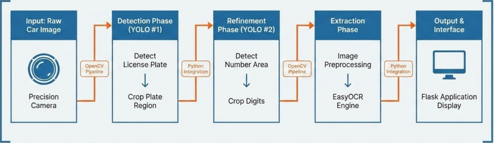

# 🇯🇴 Jordanian License Plate Recognition System

AI-based Automatic Number Plate Recognition (ANPR) system for Jordanian vehicle plates using **YOLOv8** and **EasyOCR** 🚗🤖

---

# ✨ Features

✅ YOLOv8 license plate detection  
✅ Number-region detection  
✅ OCR text recognition pipeline  
✅ Flask web application  
✅ Image preprocessing  
✅ Jordanian plate support 🇯🇴  
✅ Multi-stage AI architecture  

---

# 🏗️ System Architecture



---

# 🚀 Quick Installation & Run Guide

## 📌 Step 1 — Open Terminal

You can use:
- Mac Terminal
- VS Code Terminal

---

## 📌 Step 2 — Copy & Paste These Commands

```bash
# Clone the project from GitHub
git clone https://github.com/OmarAbuTobah/Jordanian-ANPR-System.git

# Open the project folder
cd Jordanian-ANPR-System

# Create Python virtual environment
python3 -m venv venv

# Activate virtual environment
source venv/bin/activate

# Install required libraries
pip install -r requirements.txt

# Run the application
python app.py
```

---

## 📌 Step 3 — Open the Web Application

Open this link in your browser:

```text
http://127.0.0.1:5001
```

---

# 🧠 How It Works

1️⃣ Upload vehicle image  
2️⃣ YOLO #1 detects license plate  
3️⃣ YOLO #2 detects number region  
4️⃣ Image preprocessing starts  
5️⃣ EasyOCR reads plate digits  
6️⃣ Final result displayed on screen  

---

# 🔮 Future Improvements

🚀 Character-level YOLO detection  
🚀 Video support  
🚀 Real-time camera recognition  
🚀 Arabic character recognition  
🚀 OCR optimization  
🚀 Mobile application integration  

---

# 📸 Screenshots

## 🖥️ Web Interface


---

## 🎯 Detection Result


---