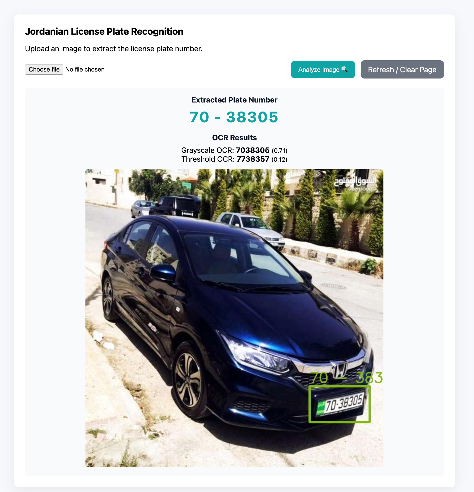

# Jordanian License Plate Recognition System

AI-based Automatic Number Plate Recognition (ANPR) system for Jordanian vehicle plates using YOLOv8 and EasyOCR.

---

## Features

- YOLOv8 plate detection
- Number-region detection
- OCR pipeline
- Flask web application
- Image preprocessing
- Jordanian plate support

---

## Architecture

Car Image
   ↓
YOLO #1 → detect plate
   ↓
Crop plate
   ↓
YOLO #2 → detect number region
   ↓
Preprocessing
   ↓
EasyOCR
   ↓
Final plate number

---

## Installation

```bash
git clone https://github.com/OmarAbuTobah/Jordanian-ANPR-System.git
cd Jordanian-ANPR-System

pip install -r requirements.txt

python app.py
```

---

## Future Improvements

- Character-level YOLO detection
- Video support
- Real-time camera recognition
- Arabic character recognition
- OCR optimization

---

## Screenshots

### Web Interface


### Detection Result




